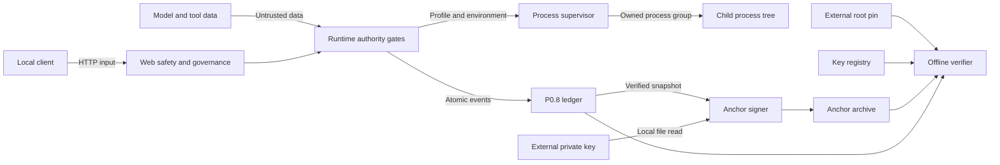

# AOIA-Core NZ Operational Hardening Threat Model

## Executive summary

AOIA-Core is a local-first, single-operator control runtime in which provider
output is not authority. The highest residual risks are availability pressure
at the local HTTP and child-process boundaries, loss of process-tree ownership
against a deliberately hostile same-UID child, disclosure through operational
output, and rollback of all local provenance freshness evidence. P0.1-P0.13
and P1.1-P1.3 add concrete fail-closed controls, but do not claim container
isolation, external freshness, multi-host recovery, or protection from a fully
compromised host.

## Scope and assumptions

In-scope runtime paths are `runtime/`, the active development helper
`scripts/dev/create_ioa_lab_clone.py`, and the P0/P1 regression tests under
`tests/`. The primary review focus is `runtime/webapp.py`,
`runtime/web_resource_governance.py`, `runtime/safety/bounded_subprocess.py`,
`runtime/safety/subprocess_supervisor.py`, `runtime/tools/provenance.py`,
`runtime/tools/provenance_anchor.py`, and `runtime/sensitive_redaction.py`.

CI/release automation, archived audit material, final-recording/demo scripts,
frozen submission trees, external providers, deployments, cloud services,
remote reconnaissance, and production credentials are out of scope. P1.3 is a
library/API surface for explicit local operator use; it is not connected to web
routing, startup, approval, execution, or recovery
(`runtime/tools/provenance_anchor.py::create_provenance_anchor`).

Assumptions established by the execution task and repository instructions:

- deployment is local/offline and single-operator, not public internet or
  multi-tenant service;
- human approval, action hashes, capability policy, and existing P0 authority
  gates remain trusted (`AGENTS.md`, sections 1 and 5;
  `runtime/tools/executor.py::ExecutionEngine`);
- the OS enforces normal Unix ownership, modes, processes, and signals, and the
  P1.2 supported platform supplies Linux `/proc`, pidfds, and `prctl`
  (`runtime/safety/subprocess_supervisor.py::supervise`);
- the locally installed `cryptography` Ed25519 primitive is sound; backend
  absence is an explicit failure (`runtime/tools/provenance_anchor.py::_crypto`);
- the operator retains the provenance root fingerprint separately from signed
  records and understands that it establishes key trust, not freshness; and
- wall-clock anchor timestamps are metadata, while monotonic time is used for
  resource accounting (`runtime/web_resource_governance.py::BoundedRateLimiter`).

Open questions that would change future risk ranking, but are explicitly not
part of this freeze:

- Will the HTTP listener ever be exposed beyond a trusted local host or placed
  behind a TLS proxy?
- Will a future operator deploy a delegated cgroup/PID namespace or an external
  WORM/freshness witness?
- Will `cryptography` become a declared installation dependency and will
  private keys move to an HSM/OS key service?

## System model

### Primary components

- `runtime/main.py::AgentRuntime` coordinates local requests, model/tool
  feedback, checkpoints, recovery, console output, and state persistence.
- `runtime/webapp.py::AOIAWebServer`,
  `runtime/webapp.py::CodexStyleHandler.do_GET`, and
  `runtime/webapp.py::CodexStyleHandler.do_POST` expose static UI plus the
  local `/api/*` surface. P0.12 policy is represented by
  `runtime/webapp.py::WebBoundaryConfig`, `load_web_boundary_config`,
  authentication/origin checks, and `CodexStyleHandler._read_json_body`.
- `runtime/web_resource_governance.py` supplies `BoundedExecutor`,
  `BoundedRateLimiter`, `ClientActivityLimiter`, `DeadlineSocketReader`, and
  `DeadlineSocketWriter` for P1.1.
- `runtime/safety/bounded_subprocess.py::run_bounded_subprocess` is the central
  Python child-process API. It selects finite profiles and validates supervisor
  reports.
- `runtime/safety/subprocess_supervisor.py::supervise` is the Linux process-tree
  owner and rlimit/termination boundary.
- `runtime/tools/idempotency.py::DurableIdempotencyStore`,
  `runtime/safety/atomic_persistence.py`, and P0.9/P0.10 checkpoint/recovery
  modules persist effect and recovery truth.
- `runtime/tools/provenance.py::AppendOnlyProvenanceStore` produces and verifies
  the P0.8 local hash chain.
- `runtime/tools/provenance_anchor.py::provision_external_signing_key`,
  `runtime/tools/provenance_anchor.py::register_initial_verification_key`,
  `runtime/tools/provenance_anchor.py::rotate_verification_key`,
  `runtime/tools/provenance_anchor.py::create_provenance_anchor`, and
  `runtime/tools/provenance_anchor.py::verify_latest_provenance_anchor`
  implement explicit local key, anchor, and offline-verification operations.
- `runtime/sensitive_redaction.py::SensitiveValueRedactor` and
  `runtime/sensitive_redaction.py::build_runtime_redactor` protect model,
  console, HTTP, and durable operational projections after canonical
  receipt/provenance hashes are formed.

### Data flows and trust boundaries

- Local client -> HTTP handler: bearer token, origin, path, headers, and JSON
  cross a TCP/HTTP boundary. P0.12 provides constant-time bearer comparison,
  exact route/origin policy, strict bounded JSON framing, safe errors, and
  security headers; P1.1 adds host-keyed admission/rate bounds and absolute I/O
  and lifecycle deadlines (`runtime/webapp.py::CodexStyleHandler.do_GET`,
  `CodexStyleHandler.do_POST`, `CodexStyleHandler._read_json_body`;
  `runtime/web_resource_governance.py::WebResourceLimits`).
- Model/provider/tool data -> AgentRuntime: prompts, responses, tool arguments,
  and result fields cross an untrusted-data boundary. Capability/approval gates
  remain authoritative; P0.13 redacts known values before operational sinks
  (`runtime/main.py::AgentRuntime`; `runtime/tools/executor.py::ExecutionEngine`;
  `runtime/sensitive_redaction.py::SensitiveValueRedactor`).
- Runtime -> supervisor -> child: argv, stdin, an explicit sanitized
  environment, timeout, cancellation pipe, and finite resource profile cross
  local pipes/process boundaries. Shell/preexec/session ownership is rejected
  at the central API; the target runs in its own process group inside the
  supervisor's session (`runtime/safety/bounded_subprocess.py::run_bounded_subprocess`;
  `runtime/safety/subprocess_supervisor.py::_apply_limits`).
- Runtime -> atomic state: task/action identities, idempotency records,
  checkpoints, and recovery evidence cross local filesystem locks. P0.6 pins
  paths and atomically replaces state; P0.7/P0.10 reject conflicting/uncertain
  redispatch (`runtime/safety/atomic_persistence.py::locked_update_json`;
  `runtime/tools/idempotency.py::DurableIdempotencyStore`).
- Runtime -> P0.8 ledger: bounded canonical events cross a locked JSONL
  boundary. The full hash chain and exact schemas are verified before a signed
  checkpoint is derived (`runtime/tools/provenance.py::verify_provenance_chain`;
  `runtime/tools/provenance.py::AppendOnlyProvenanceStore`).
- External key file -> anchor signer: PKCS#8 private bytes cross a local file to
  in-process Ed25519 boundary after absolute-path, forbidden-root, owner/mode,
  no-follow, inode, hardlink, and size checks
  (`runtime/tools/provenance_anchor.py::provision_external_signing_key`,
  `runtime/tools/provenance_anchor.py::_load_private_key`).
- Registry/archive/ledger -> offline verifier: untrusted JSON and public keys
  cross exact bounded parsers. Trust starts at an independently retained root
  fingerprint, then requires contiguous dual-signed rotation, active signer,
  archive parent linkage, Ed25519 signature, project/ledger identity, full P0.8
  verification, and recorded-prefix equality
  (`runtime/tools/provenance_anchor.py::register_initial_verification_key`,
  `runtime/tools/provenance_anchor.py::rotate_verification_key`,
  `runtime/tools/provenance_anchor.py::verify_provenance_anchor`,
  `runtime/tools/provenance_anchor.py::verify_latest_provenance_anchor`).

#### Diagram

## Assets and security objectives

| Asset | Why it matters | Security objective (C/I/A) |
| --- | --- | --- |
| Human approval, action hashes, capability policy | Determines whether an operation is authorized. | I |
| Request/trace/task/action/operation identity and outcome | Prevents false attribution, false success, and unsafe retry. | I/A |
| Idempotency, checkpoint, and recovery state | Duplicate or rolled-back effects can corrupt local work. | I/A |
| P0.8 ledger and exact signed prefixes | Records ordered local evidence for later review. | I/A |
| Registered secret values | Leakage can compromise local/provider accounts or trust material. | C |
| Local HTTP availability | The operator must retain bounded access during malformed or excessive input. | A |
| Host CPU, memory, FDs, process table, and disk | Unbounded children/requests can deny service or damage unrelated work. | I/A |
| External Ed25519 private key | Compromise permits forged future anchors. | C/I |
| Root fingerprint and public-key rotation chain | Defines which signatures are trusted. | I/A |
| Signed anchor archive/latest selector | Makes retained ledger replacement or partial rollback detectable. | I/A |

## Attacker model

### Capabilities

- A local network client can send unauthenticated, wrongly authenticated,
  malformed, slow, concurrent, or high-rate HTTP requests.
- Untrusted model/provider/tool output can contain synthetic or real sensitive
  values, hostile structured fields, and misleading success text.
- An authorized child can consume CPU, memory, FDs, tasks, output, and file
  space; fork, double-fork, call setsid, ignore TERM, kill its supervisor, or
  cause a missing terminal report. The target cannot write the supervisor
  report after exec because that descriptor is closed in
  `runtime/safety/subprocess_supervisor.py::_child_exec`.
- A local actor without the current signing key can edit, truncate, replace,
  replay, or partially delete ledger, anchor, pointer, registry, and public-key
  files, and attempt path/symlink/hardlink/ancestor swaps.
- A local actor may possess a retired historical signing key after rotation.
- Storage contention, process crashes, and atomic-write failures may occur at
  adversarial times.

### Non-capabilities

- The modeled attacker does not simultaneously control the kernel, trusted
  runtime code, current private signing key, independent root/freshness pins,
  and every evidence file.
- Public-internet reachability, multi-tenancy, remote shell access, cloud
  credentials, and external provider control are not assumed for this local
  freeze.
- Ed25519/SHA-256 cryptographic breaks and reliable extraction of arbitrary
  process memory are out of scope.
- Anchors, provider output, critic output, web requests, and metadata cannot
  directly grant execution authority under the documented P0 design.

## Entry points and attack surfaces

| Surface | How reached | Trust boundary | Notes | Evidence (repo path / symbol) |
| --- | --- | --- | --- | --- |
| Static UI and public health | Local HTTP GET | Socket -> HTTP handler | Health is public/lightweight; API namespace cannot fall through to static files. | `runtime/webapp.py::CodexStyleHandler.do_GET`, `runtime/webapp.py::PUBLIC_HEALTH_PATHS` |
| Authenticated read APIs | Bearer-authenticated GET | Client -> runtime read projection | Exact allowlist; origin/query/path normalization and safe response projection. | `runtime/webapp.py::AUTHENTICATED_READ_PATHS`, `runtime/webapp.py::CodexStyleHandler._authenticate` |
| Authenticated mutation APIs | Bearer-authenticated POST JSON | Client -> serialized mutation | Auth/origin/rate checks precede body/dispatch; strict object JSON. | `runtime/webapp.py::AUTHENTICATED_MUTATION_PATHS`, `runtime/webapp.py::CodexStyleHandler._read_json_body`, `runtime/webapp.py::CodexStyleHandler._build_pending_post` |
| Web resource policy | Environment at server construction | Operator config -> listener | Strict numeric ranges; invalid policy fails startup. | `runtime/web_resource_governance.py::load_web_resource_limits` |
| Main local runtime | Python/CLI startup and in-process calls | Operator/model -> AgentRuntime | Human/capability policy remains authoritative; provider output is data. | `runtime/main.py::main`, `runtime/main.py::AgentRuntime` |
| Controlled child boundary | Internal runtime adapters | Runtime -> supervisor/child | Requires explicit environment, timeout, and profile; captures bounded output. | `runtime/safety/bounded_subprocess.py::run_bounded_subprocess` |
| Supervisor protocol | JSON config/report and OS pipes | Parent -> supervisor -> target | Exact STARTED/TERMINAL report order and PID/schema/exit consistency. | `runtime/safety/subprocess_supervisor.py::main`, `runtime/safety/subprocess_supervisor.py::supervise` |
| Durable local state | Internal state transitions | Runtime -> filesystem | Locked, pinned, atomic JSON/JSONL updates. | `runtime/safety/atomic_persistence.py::locked_update_json`, `runtime/safety/atomic_persistence.py::read_json_snapshot` |
| Provenance ledger | Runtime provenance append and offline read | Runtime/evidence -> JSONL | Exact bounded schemas, sequences, hashes, and lock. | `runtime/tools/provenance.py::AppendOnlyProvenanceStore`, `runtime/tools/provenance.py::verify_provenance_chain` |
| Key provisioning/rotation | Explicit local Python API | Operator file -> key registry | External owner-only key, external root pin, immutable dual-signed rotation. | `runtime/tools/provenance_anchor.py::provision_external_signing_key`, `runtime/tools/provenance_anchor.py::register_initial_verification_key`, `runtime/tools/provenance_anchor.py::rotate_verification_key` |
| Anchor create/verify | Explicit local Python API | Ledger/key/archive -> signer/verifier | Offline only; exact typed results; no web/authority integration. | `runtime/tools/provenance_anchor.py::create_provenance_anchor`, `runtime/tools/provenance_anchor.py::verify_latest_provenance_anchor` |
| Operational output sinks | Model feedback, console, HTTP, and history | Untrusted result -> operator/state | Canonical P0.7/P0.8 hashes form before redacted projections; execution-record filenames are runtime-generated from timestamp/action identity rather than untrusted output. | `runtime/sensitive_redaction.py::SensitiveValueRedactor`; `runtime/tools/executor.py::ExecutionEngine._record_execution` |

## Top abuse paths

1. Availability attack -> open/queue many local HTTP requests -> exhaust worker
   threads -> P1.1 bounded admission rejects excess with `WEB_SERVER_BUSY`
   rather than spawning unbounded work.
2. Slow-client attack -> drip headers or stall a declared body -> retain a
   worker -> absolute header/body/lifecycle deadlines close the request with a
   safe timeout envelope.
3. False-completion attack -> start a mutation and let its HTTP deadline expire
   -> tempt the server to report timeout as cancellation -> atomic dispatch
   state reports `UNKNOWN_OUTCOME`, retains the operation permit, and prevents
   a late second response.
4. Process-tree exhaustion -> authorized child forks/detaches/ignores TERM and
   consumes CPU/RSS/FDs/files/tasks -> supervisor applies profiles, rescans,
   escalates, and reaps; loss of ownership is explicit, never success.
5. Secret exfiltration -> inject a registered key into provider/tool output ->
   route it toward model feedback, HTTP, console, or persistence -> P0.13
   redacts operational projections after canonical evidence hashes.
6. Ledger forgery -> rewrite P0.8 events and recompute a self-consistent local
   SHA-256 chain -> compare against a retained signed anchor prefix -> offline
   verification returns `ANCHOR_LEDGER_MISMATCH` once an anchor lineage exists.
7. Key substitution -> replace registry keys and forge an anchor with an
   attacker key -> verifier begins from the external root fingerprint and
   rejects missing/broken rotation or an inactive signer.
8. Partial rollback -> restore an older pointer/ledger while newer signed
   archive entries remain -> canonical archive-chain verification detects the
   stale pointer/prefix. Deleting all newer local evidence as well is the
   documented freshness gap.
9. Filesystem redirection -> swap a symlink/ancestor during key or archive write
   -> forbidden-root, no-follow/inode checks, pinned directory FDs, and atomic
   no-replace writes reject or contain the operation.

## Threat model table

| Threat ID | Threat source | Prerequisites | Threat action | Impact | Impacted assets | Existing controls (evidence) | Gaps | Recommended mitigations | Detection ideas | Likelihood | Impact severity | Priority |
| --- | --- | --- | --- | --- | --- | --- | --- | --- | --- | --- | --- | --- |
| TM-001 | Local HTTP client | Listener reachable on the local host/network. | Exhaust concurrent, queued, per-client, or limiter state with many requests. | Operator-service denial; possible host pressure. | HTTP availability; host CPU/RAM/FDs. | Fixed pools/backlog/client map and expiring buckets (`runtime/web_resource_governance.py::BoundedExecutor`, `runtime/web_resource_governance.py::BoundedRateLimiter`, `runtime/web_resource_governance.py::ClientActivityLimiter`). | No distributed limiter; local plaintext unless separately proxied. | If exposure expands, add reviewed TLS/network ACL and per-deployment telemetry; do not add multi-user claims implicitly. | Count `WEB_SERVER_BUSY`/`WEB_RATE_LIMITED`, queue occupancy, and rejected client-host hashes without tokens. | Medium: local reachability is required, but request generation is easy. | Medium: bounded controls prevent host-wide unbounded growth, but UI availability can degrade. | medium |
| TM-002 | Slow local HTTP client | Connection admitted. | Drip headers, stall body, or block response writes to occupy capacity. | Worker starvation and degraded operator access. | HTTP availability. | Absolute readers/writer and lifecycle deadline (`runtime/web_resource_governance.py::DeadlineSocketReader`, `runtime/web_resource_governance.py::DeadlineSocketWriter`; `runtime/webapp.py::CodexStyleHandler._write_request_deadline`). | Started non-cooperative runtime work cannot be forcibly killed by HTTP layer. | Retain absolute deadlines; expose local timeout counters if an operational metrics surface is later approved. | Count header/body/write/deadline outcomes and duration percentiles. | Medium: simple locally; bounded by admission. | Medium: service degradation, no authority bypass. | medium |
| TM-003 | Local HTTP client | Valid or guessed operator token, or repeated auth attempts. | Brute-force/flood reads and mutations or place secrets in URLs. | Unauthorized data/action attempt or token disclosure. | Operator token; runtime integrity; HTTP availability. | Constant-time bearer auth, all API queries rejected, exact route/origin/content rules, stricter mutation rate (`runtime/webapp.py::CodexStyleHandler._authenticate`, `runtime/webapp.py::AUTHENTICATED_MUTATION_PATHS`). | Token rotation is restart-only; no multi-user sessions. | Keep token high entropy and local; add an authenticated reload only under a separately reviewed secret lifecycle. | Count auth failures/rate outcomes without recording Authorization or query text. | Low: local access plus token knowledge/guessing required; rate controls apply. | High: a valid operator token reaches mutation endpoints, though P0 authority still applies. | medium |
| TM-004 | Untrusted runtime/model operation | A mutation crosses dispatch before HTTP deadline. | Exploit deadline races to induce false cancellation, retry, or late writes. | Duplicate/uncertain effects and false success. | Outcome truth; idempotency/recovery state. | Atomic PENDING/STARTED/CANCELLED gate, one response, held operation permit, P0.7/P0.11 unknown semantics (`runtime/webapp.py::AOIAWebServer.submit_operation`, `runtime/webapp.py::CodexStyleHandler._execute_operation`; `runtime/outcomes.py::outcome_from_exception`; `runtime/tools/idempotency.py::DurableIdempotencyStore`). | Started work may complete after client receives unknown. | Preserve P0 task/subprocess budgets and expose reconciliation guidance rather than automatic retry. | Audit `UNKNOWN_OUTCOME`, task/action IDs, and subsequent reconciliation without raw secrets. | Low: requires precise timing and an authorized mutation. | High: mishandling could duplicate effects; current control fails closed. | medium |
| TM-005 | Authorized child process | Runtime policy already permits a subprocess. | Consume CPU, memory, FDs, tasks, file/output space, detach, or ignore TERM. | Host denial, leaked processes, partial side effects. | Host resources; action outcome; repository/state integrity. | Profiles, rlimits, sampled tree RSS/tasks, bounded capture, subreaper/session/PGID, TERM-rescan-KILL-reap (`runtime/safety/bounded_subprocess.py::run_bounded_subprocess`; `runtime/safety/subprocess_supervisor.py::supervise`). | No delegated cgroup/PID namespace; RLIMIT_NPROC is per UID; monitoring is sampled. | For hostile-code use, require a delegated cgroup/namespace/seccomp design; tune profiles with evidence. | Emit typed limit/lost reasons and verify no survivors by PID/start time in local diagnostics. | Medium: allowed local children can misbehave; policy approval is prerequisite. | High: host resource loss or partial mutation is material. | high |
| TM-006 | Hostile same-UID child | Child can signal the supervisor and detach before ownership is lost. | Kill supervisor to escape user-space tree reclamation. | Detached descendant survives; effects become uncertain. | Process lifetime; host resources; idempotency truth. | Target PDEATHSIG, report validation, explicit `PROCESS_CONTAINMENT_LOST` -> `UNKNOWN_OUTCOME` (`runtime/safety/subprocess_supervisor.py::_child_exec`; `runtime/safety/bounded_subprocess.py::_reports`; `runtime/outcomes.py::outcome_from_exception`). | User-space supervisor cannot guarantee cleanup after its own destruction. | Treat such programs as unsupported; use delegated cgroup/PID namespace/seccomp before claiming hostile containment. | Alert on lost/missing supervisor terminal report; require operator cleanup/reconciliation. | Low: requires an already authorized, deliberately hostile same-UID child. | High: escape and uncertain effects can persist. | high |
| TM-007 | Local evidence editor | At least one trusted signed anchor lineage is retained. | Rewrite/truncate/replace P0.8 ledger and recompute its unsigned hash chain. | Fabricated or missing audit history. | P0.8 ledger; anchor evidence. | Full locked chain verification plus project/ledger/count/tip signature and prior-prefix continuity (`runtime/tools/provenance.py::verify_provenance_chain`; `runtime/tools/provenance_anchor.py::create_provenance_anchor`). | The first anchor can only attest the then-current self-consistent chain. | Provision the first key/anchor through a trusted operator ceremony and retain its identity externally. | Periodically verify latest and compare retained anchor sequence/hash. | Medium: local file access is plausible; signing key is not required for rewrite. | High: undetected fabricated audit would undermine evidence. | high |
| TM-008 | Local registry/anchor editor or retired-key holder | Can modify public records or has an old private key, but not the active key/root pin. | Substitute keys, fork rotation, sign current tip with retired key, or alter signature. | Forged trust lineage or false anchor validity. | Root trust; key registry; anchor integrity. | External root pin, fingerprint-addressed immutable keys, old+new signatures, contiguous generations, active-tip signer, Ed25519 verification (`runtime/tools/provenance_anchor.py::register_initial_verification_key`; `runtime/tools/provenance_anchor.py::rotate_verification_key`; `runtime/tools/provenance_anchor.py::_validated_registry_tip`). | Root pin loss/replacement outside runtime invalidates the assumption. | Store root fingerprint and latest checkpoint in a separately controlled operator record; consider OS/HSM custody in future. | Verify registry/archive on every anchor operation; report exact UNKNOWN_KEY/SIGNATURE_INVALID outcomes. | Low: requires local record access or retired key plus failure of several checks. | High: successful forgery would corrupt provenance trust. | high |
| TM-009 | Local state rollback actor | Can delete/restore ledger, archive, pointer, and registry together; no separate freshness checkpoint exists. | Restore an older mutually consistent legitimately signed state. | Newer history disappears while old state verifies current. | Ledger/anchor freshness and availability. | Signed sequence/parent chain detects partial rollback while newer archives remain (`runtime/tools/provenance_anchor.py::_validated_anchor_archive`; `runtime/tools/provenance_anchor.py::verify_latest_provenance_anchor`). | Complete local rollback is indistinguishable without external/independent freshness. | Retain latest anchor hash/sequence outside the rolled-back state or publish to approved WORM/external witness in a future phase. | Compare current sequence/hash with operator-retained checkpoint; alarm on decrease/missing suffix. | Medium: requires broad local data access but no signing key. | High: silent loss of audit freshness. | high |
| TM-010 | Local filesystem attacker | Can race path components, symlinks, hardlinks, permissions, or atomic failures. | Redirect private-key reads or registry/archive writes outside intended roots. | Key disclosure, arbitrary overwrite, or unavailable evidence. | Private key; repository/state integrity; archive. | Resolved forbidden roots, owner/mode/nlink checks, O_NOFOLLOW/inode binding, pinned directory FDs, atomic archive-first writes (`runtime/tools/provenance_anchor.py::_load_private_key`; `runtime/tools/provenance_anchor.py::_write_immutable_record`; `runtime/tools/provenance_anchor.py::_write_registry_pointer_pinned`; `runtime/tools/provenance_anchor.py::_persist_anchor_then_pointer`; `runtime/safety/atomic_persistence.py::locked_update_json`). | Python cannot zeroize key bytes; first enrollment interruption can need manual repair. | Keep key/anchor roots owner-only on trusted local storage; document/manual-test recovery ceremony. | Audit configuration failures and verify no unexpected files under project/forbidden roots. | Low: requires local filesystem race/access. | High: key theft or arbitrary write is material. | high |
| TM-011 | Untrusted model/provider/tool output | Known secret appears in text, structured fields, errors, or a success payload. | Route secret to model context, HTTP, console, or durable files. | Credential/key disclosure. | Registered secrets; logs/history; operator output. | Central immutable redactor at executor/main/memory/provider/web boundaries after canonical hashes (`runtime/sensitive_redaction.py::SensitiveValueRedactor`; `runtime/tools/executor.py::ExecutionEngine._attach_authoritative_outcome`; `runtime/webapp.py::CodexStyleHandler._response_redactor`). | Arbitrary unregistered secrets outside patterns are not guaranteed; process memory remains in scope of host. | Register secrets through approved lifecycle; avoid logging raw unknown objects; keep canary regression scans. | Scan isolated test artifacts for synthetic canaries; count redaction markers without logging source values. | Medium: secret-bearing outputs are realistic. | High: credential disclosure can affect external accounts. | high |
| TM-012 | Model/provider/web/anchor consumer | Consumer mistakes metadata/evidence for authority or collapses malformed state to success. | Use provider verdict, anchor validity, or unknown outcome to approve/redispatch. | Authority escalation, duplicate action, or false success. | Approval policy; task state; idempotency/recovery. | Repository authority rule, separate anchor module, exact outcome enums, and P0.7 unknown fencing (`AGENTS.md::Safety Invariants`; `runtime/outcomes.py::NZOutcomeStatus`; `runtime/tools/idempotency.py::DurableIdempotencyStore`). | Future integrations could accidentally cross the boundary. | Keep static import/authority tests and require security review for any anchor/web/executor integration. | Audit imports and terminal outcome transitions; fail CI on unknown success mappings. | Low: current architecture has no such integration. | High: authority escalation violates the core safety model. | medium |

Risk ranking assumes local single-operator exposure, valid P0 approval gates, and
separate key/root custody. Public network exposure, multi-user operation,
arbitrary unapproved child execution, or shared custody of every trust artifact
would increase the likelihood of TM-001/TM-003/TM-005/TM-009 substantially.

## Criticality calibration

- **Critical** means a plausible local/pre-auth path directly grants execution
  authority, exposes the active signing/operator key, or produces undetected
  arbitrary effects without existing fail-closed controls. Examples would be a
  bearer-auth bypass plus mutation authority, a path escape reading the active
  private key, or an outcome mapper converting containment loss to success. No
  such unmitigated path was retained in this freeze.
- **High** means material host/evidence/credential compromise requiring a real
  prerequisite, with incomplete containment or a documented gap. Examples are
  hostile supervisor destruction (TM-006), full local provenance rollback
  without a freshness witness (TM-009), and secret-output leakage (TM-011).
- **Medium** means bounded service denial or a high-impact action made unlikely
  by local access plus authentication/approval requirements. Examples are HTTP
  admission/slow-client pressure (TM-001/TM-002), token abuse under local rate
  controls (TM-003), and deadline/idempotency races fenced as unknown (TM-004).
- **Low** means noisy, readily detected behavior with low-sensitivity impact and
  simple local recovery. Examples include isolated malformed-schema rejection,
  an unauthenticated request rejected before body read, or an unavailable
  optional crypto backend returning `ANCHOR_CRYPTO_UNAVAILABLE`.

## Focus paths for security review

| Path | Why it matters | Related Threat IDs |
| --- | --- | --- |
| `runtime/webapp.py` | Authentication, origin/path/JSON policy, HTTP routing, dispatch truth, safe outcomes, and response redaction meet here. | TM-001, TM-002, TM-003, TM-004, TM-011 |
| `runtime/web_resource_governance.py` | Defines finite request, queue, client, limiter, and absolute socket-deadline primitives. | TM-001, TM-002, TM-003 |
| `runtime/safety/bounded_subprocess.py` | Central active Python subprocess API, profile selection, bounded capture, cancellation, and report validation. | TM-005, TM-006, TM-012 |
| `runtime/safety/subprocess_supervisor.py` | Linux subreaper, rlimits, process discovery, termination escalation, and cleanup proof. | TM-005, TM-006 |
| `runtime/outcomes.py` | Maps timeout, cancellation, setup failure, resource intervention, and lost containment to truthful P0.11 states. | TM-004, TM-005, TM-006, TM-012 |
| `runtime/tools/idempotency.py` | Durable action ownership/replay fencing prevents uncertain effects from redispatching. | TM-004, TM-005, TM-012 |
| `runtime/safety/atomic_persistence.py` | Pinned locks and atomic replacements protect all integrity-critical local state. | TM-007, TM-009, TM-010 |
| `runtime/tools/provenance.py` | Canonical P0.8 schemas, append lock, sequence/hash verification, and ledger bounds. | TM-007, TM-009 |
| `runtime/tools/provenance_anchor.py` | External key checks, independent trust root, rotation, archive linkage, signing, and offline taxonomy. | TM-007, TM-008, TM-009, TM-010, TM-012 |
| `runtime/sensitive_redaction.py` | Central known-value and structured-field protection with bounded traversal. | TM-011 |
| `runtime/main.py` | Runtime lifecycle connects provider/model data, executor results, logs, transcript, checkpoints, and recovery. | TM-004, TM-011, TM-012 |
| `runtime/tools/executor.py` | Canonical receipt/provenance ordering and post-canonical redacted operational projection. | TM-004, TM-005, TM-011, TM-012 |
| `tests/test_web_resource_governance.py` | Deterministic regressions for queue, limiter, slow I/O, deadlines, and no false success. | TM-001, TM-002, TM-003, TM-004 |
| `tests/test_process_resource_containment.py` | Synthetic tree/resource/report/cancellation attacks and no-survivor assertions. | TM-005, TM-006 |
| `tests/test_trusted_provenance_anchor.py` | Key/path/tamper/rotation/atomic/taxonomy/freshness boundary regressions. | TM-007, TM-008, TM-009, TM-010 |

## Quality check

- [x] Discovered local runtime entry points are represented: CLI/in-process
  runtime, static/health/read/mutation HTTP, controlled subprocess boundary,
  durable state/ledger, explicit key/rotation API, anchor create/verify, and
  operational output sinks.
- [x] Every modeled trust boundary appears in at least one threat: HTTP
  (TM-001-TM-004), runtime/child (TM-005-TM-006), ledger/signer/verifier
  (TM-007-TM-010), output sinks (TM-011), and authority consumption (TM-012).
- [x] Runtime behavior is separated from CI/build/dev tools, tests, demos,
  archives, and frozen evidence; those excluded surfaces are not assigned
  runtime guarantees.
- [x] The operator's supplied context resolves deployment, ownership,
  authentication, network, and no-external-service assumptions; no routine
  clarification was needed for this execution freeze.
- [x] Conditional/open questions are explicit under Scope and assumptions and
  are not presented as implemented controls or P2 work.
